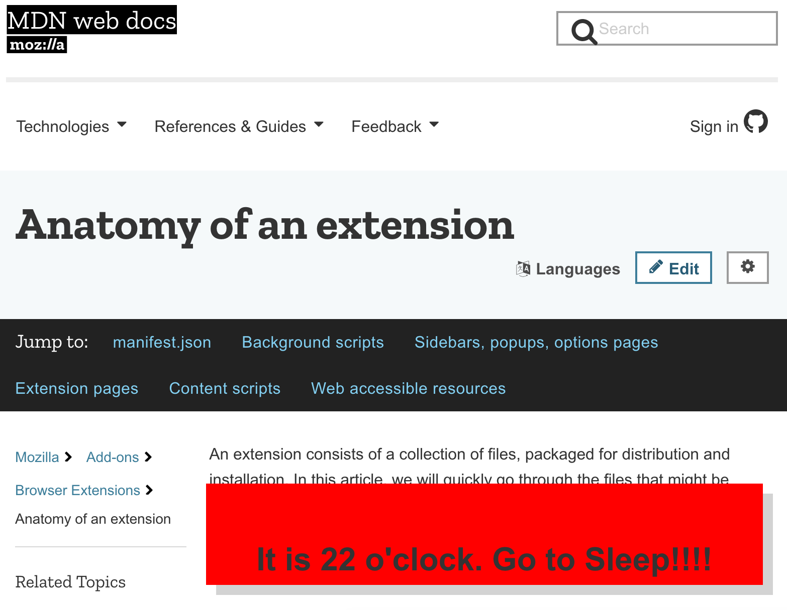

# Bedtime Extension

## What is it?
Bedtime is an extension remind you/me to get off the internet and to go to sleep. The extension displays a warning on the lower right hand of a website, telling you well, to go to sleep, if you browse the web after your bedtime.

The browser extension can be installed from Firefox Add-ons: https://addons.mozilla.org/en-US/firefox/addon/bedtime/.

After installing the browser extension, you can set your bedtime in the using the popup in the browser bar. The options are 9 pm, 10 pm, 11 pm and midnight. If you'd like to set the bedtime later, feel free to fork this repo or open an issue!

## Why is it?
To remind myself late at night, on the web, to go to bed! 
And in case anyone else needed that reminder too. 

## How is it?
The browser extension has the same key elements of all browser extensions. 

The `manifest.json` file gives the browser extenion permission to run on the active tab, for all websites, to store the bedtime from the popup and to set the icon for the browser bar. 

The `content_script.js` script runs on every page you visit, checking whether the current time is after either the current bedtime  _and_ before 6 am. The current bedtime is either the one set from the popup, or the system default (11 pm). 

The `popup.js` script listens to clicks to the popup and then sends the storedbedtime to the `content_script.js` file. 

## Thanks to:
All those at Codebar.io and Web Frontend Co-Learning meetups who helped me talking through learning how to make an extension!

Also thanks to all the folks who wrote the helpful guide at https://developer.mozilla.org/en-US/docs/Mozilla/Add-ons/WebExtensions/Anatomy_of_a_WebExtension. 